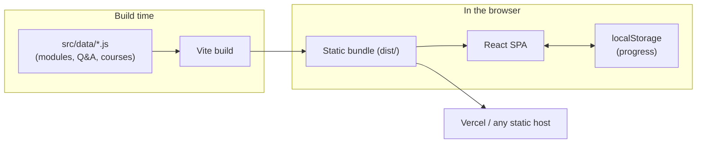

# AI Courseware

Interactive, self-paced courseware — **agentic AI systems & enterprise architecture**, a **Software Architect** prep track, and full **System Design** and **Low-Level Design** courses. Curated reading, practice problems, and Q&A, with progress tracking saved in your browser.

It's a **pure static single-page app** — no backend, no database. All content is bundled at build time and progress persists in `localStorage`, so it deploys anywhere static (Vercel, Netlify, GitHub Pages) with zero configuration.

## Contents

- **Track 1–3 — Agentic AI Core → Applied Architecture** — 9 modules (LangGraph, GraphRAG, agent memory, evals, RAG, MCP, iPaaS, capstone).
- **Q&A Bank** — 50 concept/scenario/behavioral questions with answers.
- **Roles — Software Architect** — a study track + Q&A across the dimensions a senior architect interview assesses.
- **Course · System Design (HLD)** — 7 modules: scalability, databases, caching, messaging, CAP, case studies.
- **Course · Low-Level Design (LLD)** — 7 modules: OOP, SOLID, UML, design patterns, case studies.

Each module has a "why it matters" intro, learning objectives, curated reading links, and practice problems with hints.

## Architecture



## Run locally

```bash
npm install
npm run dev        # http://localhost:5173
```

Build and preview the production bundle:

```bash
npm run build
npm run preview
```

## Deploy to Vercel

1. Push this repo to GitHub (already done if you're reading this there).
2. In Vercel, **Add New → Project** and import this repository.
3. Vercel auto-detects **Vite** — Build Command `npm run build`, Output Directory `dist` (also pinned in `vercel.json`). No environment variables needed.
4. Deploy. That's it.

## Editing content

All content lives in [`src/data/`](src/data/):

| File | What it holds |
|---|---|
| `modules.js` | The 9 agentic-AI modules |
| `courses.js` | System Design + Low-Level Design modules |
| `qanda.js` | The Q&A bank |
| `architect.js` | Software Architect resources + Q&A |

Edit a file and the change ships on the next build — no database or seeding step.

## Project layout

```
src/
  App.jsx              layout, sidebar, progress state
  api.js               static data + localStorage (no network)
  data/                all course content
  components/          ModuleView, QandaView, ArchitectView, ProblemCard, ProgressBar
```
